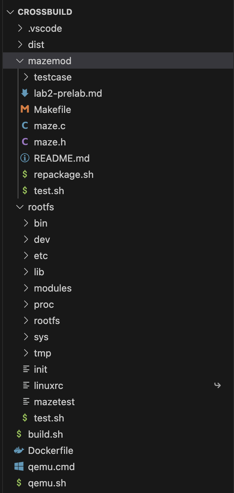
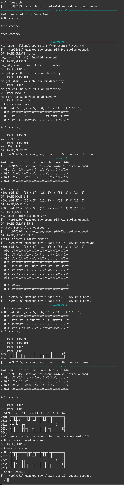

### directory layout




### `test.sh`



```
~ # ./test.sh
[    4.886265] maze: loading out-of-tree module taints kernel.
============================== mazetest 0 ==============================
### case - cat /proc/maze ###
#00: vacancy.

#01: vacancy.

#02: vacancy.

============================== mazetest 1 ==============================
### case - illegal operations (w/o create first) ###
[    4.926618] mazemod_dev_open: pid=54, device opened.
OP: MAZE_CREATE -1 -1
mz_create(-1, -1): Invalid argument
OP: MAZE_GETSIZE
mz_get_size: No such file or directory
OP: MAZE_GETPOS
mz_get_pos: No such file or directory
OP: MAZE_GETSTART
mz_get_start: No such file or directory
OP: MAZE_GETEND
mz_get_end: No such file or directory
OP: MAZE_MOVE 0 -1
mz_move: No such file or directory
[    4.929087] mazemod_dev_close: pid=54, device not found.
============================== mazetest 2 ==============================
### case - create a maze ###
[    4.931767] mazemod_dev_open: pid=55, device opened.
OP: MAZE_CREATE 35 5
- Create maze done.
#00: pid 55 - [35 x 5]: (8, 1) -> (33, 3) @ (8, 1)
- 000: ###################################
- 001: ##......*............##.####..#.###
- 002: ##..#...#.##.#.............#.#....#
- 003: #..##.##..#.##...#.#.#..........#E#
- 004: ###################################

#01: vacancy.

#02: vacancy.

OP: MAZE_GETSIZE
==> SIZE: 35 5
OP: MAZE_GETSTART
==> START: 8 1
OP: MAZE_GETEND
==> END: 33 3
OP: MAZE_GETPOS
==> POS: 8 1
OP: MAZE_DESTROY
[    4.938235] mazemod_dev_close: pid=55, device not found.
============================== mazetest 3 ==============================
### case - create a maze and then move ###
[    4.940751] mazemod_dev_open: pid=57, device opened.
OP: MAZE_CREATE 35 5
- Create maze done.
#00: pid 57 - [35 x 5]: (15, 2) -> (33, 3) @ (15, 2)
- 000: ###################################
- 001: #...###...###.#...#..#.....#.#.####
- 002: #.##..####.#.#.*.....#............#
- 003: ###.....###....#.......###.####.#E#
- 004: ###################################

#01: vacancy.

#02: vacancy.

OP: MAZE_MOVE -1 0
#00: pid 57 - [35 x 5]: (15, 2) -> (33, 3) @ (14, 2)
OP: MAZE_MOVE 1 0
#00: pid 57 - [35 x 5]: (15, 2) -> (33, 3) @ (15, 2)
OP: MAZE_MOVE 0 -1
#00: pid 57 - [35 x 5]: (15, 2) -> (33, 3) @ (15, 1)
OP: MAZE_MOVE 0 1
#00: pid 57 - [35 x 5]: (15, 2) -> (33, 3) @ (15, 2)
OP: MAZE_RESET
[    4.966513] mazemod_dev_close: pid=57, device closed.
============================== mazetest 4 ==============================
### case - multiple user ###
[    4.969230] mazemod_dev_open: pid=72, device opened.
OP: MAZE_CREATE 35 5
waiting for child processes ...
[    4.970320] mazemod_dev_open: pid=73, device opened.
OP: MAZE_CREATE 35 5
[    4.971148] mazemod_dev_open: pid=74, device opened.
OP: MAZE_CREATE 35 5
[    4.972025] mazemod_dev_open: pid=75, device opened.
OP: MAZE_CREATE 35 5
child: Cannot allocate memory
[    4.972459] mazemod_dev_close: pid=75, device not found.
#00: pid 72 - [35 x 5]: (17, 1) -> (33, 3) @ (17, 1)
- 000: ###################################
- 001: ##.#.#..#.##..##.*......##.##.#.###
- 002: #.#.##.###.###..#####.........#####
- 003: ####...#.###...#..##.#...........E#
- 004: ###################################

#01: pid 73 - [35 x 5]: (4, 2) -> (33, 3) @ (4, 2)
- 000: ###################################
- 001: #.#.##..##..##.#..###..##..##..#.##
- 002: ##.#*##..#..........#..#..........#
- 003: #..#.........##.............##...E#
- 004: ###################################

#02: pid 74 - [35 x 5]: (3, 2) -> (33, 3) @ (3, 2)
- 000: ###################################
- 001: ##.....###..###.#.###...#.#..#...##
- 002: ##.*.....#.....#..####..#...##..#.#
- 003: #####............................E#
- 004: ###################################

[    4.980725] mazemod_dev_close: pid=72, device closed.
[    4.981140] mazemod_dev_close: pid=74, device closed.
============================== mazetest 5 ==============================
[    4.981604] mazemod_dev_close: pid=73, device closed.
### case - create a maze and then read ###
[    4.982966] mazemod_dev_open: pid=80, device opened.
OP: MAZE_CREATE 35 5
- Create maze done.
#00: pid 80 - [35 x 5]: (6, 1) -> (33, 3) @ (6, 1)
- 000: ###################################
- 001: ###..#*..#.###.##..#..#..######...#
- 002: #.##.##...........................#
- 003: ###.#.##.##....#...###.##.#.#....E#
- 004: ###################################

#01: vacancy.

#02: vacancy.

OP: MAZE_GETSIZE
OP: MAZE_GETSTART
OP: MAZE_GETEND
OP: MAZE_GETPOS
- Size [35 x 5]: (6, 1) -> (33, 3) @ (6, 1)
000: ╔╦╦══╦═══╦═╦╦╦═╦╦══╦══╦══╦╦╦╦╦╦═══╗
001: ╠╩╣  ║*  ║ ╚╩╝ ╚╝  ║  ║  ╚╩╩╩╩╝   ║
002: ║ ╠═ ╚╗                           ║
003: ╠╦╣ ║ ╠╗ ╔╗    ║   ╔╦╗ ╔╗ ║ ║    E╣
004: ╚╩╩═╩═╩╩═╩╩════╩═══╩╩╩═╩╩═╩═╩════╩╝
[    4.989195] mazemod_dev_close: pid=80, device closed.
============================== mazetest 6 ==============================
### case - create a maze and then read ###
[    4.991115] mazemod_dev_open: pid=82, device opened.
OP: MAZE_CREATE 35 5
- Create maze done.
#00: pid 82 - [35 x 5]: (6, 1) -> (33, 3) @ (6, 1)
- 000: ###################################
- 001: ##.###*....##.###..#.##.#.#.......#
- 002: ###.##..##...................#....#
- 003: ##.#....####..##...#..#.##.......E#
- 004: ###################################

#01: vacancy.

#02: vacancy.

OP: MAZE_GETSIZE
OP: MAZE_GETSTART
OP: MAZE_GETEND
OP: MAZE_GETPOS
- Size [35 x 5]: (6, 1) -> (33, 3) @ (6, 1)
000: ╔╦═╦╦╦═════╦╦═╦╦╦══╦═╦╦═╦═╦═══════╗
001: ╠╣ ╚╬╣*    ╚╝ ╚╩╝  ║ ╚╝ ║ ║       ║
002: ╠╬═ ╚╝  ╔╗                   #    ║
003: ╠╣ ║    ╠╬╦╗  ╔╗   ║  ║ ╔╗       E╣
004: ╚╩═╩════╩╩╩╩══╩╩═══╩══╩═╩╩═══════╩╝
### case - create a maze and then read + randomwalk ###
- Batch move operations sent
OP: MAZE_GETPOS
- Check position
000: ╔╦═╦╦╦═════╦╦═╦╦╦══╦═╦╦═╦═╦═══════╗
001: ╠╣ ╚╬╣S    ╚╝ ╚╩╝  ║ ╚╝ ║ ║       ║
002: ╠╬═ ╚╝  ╔╗                   #    ║
003: ╠╣ ║*   ╠╬╦╗  ╔╗   ║  ║ ╔╗       E╣
004: ╚╩═╩════╩╩╩╩══╩╩═══╩══╩═╩╩═══════╩╝
- Check PASSED!
[    4.997703] mazemod_dev_close: pid=82, device closed.
```